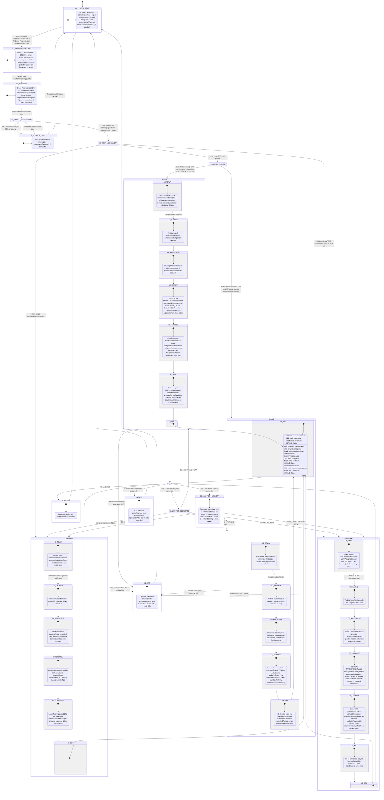

# Israeli Multi-Tiered Missile Defense System

```mermaid
stateDiagram-v2
    direction TB

    %% ─── MASTER STATES ───

    [*] --> S0_SYSTEM_READY

    state S0_SYSTEM_READY {
        direction LR
        [*] --> RadarsSurveilling
        RadarsSurveilling: All radars persistent scan\nGreen Pine / Super Green Pine\nEL/M-2084 MMR (360° or 120° sector)\nAN/TPY-2 (X-band, forward)\nSBIRS (IR satellite)
    }

    S0_SYSTEM_READY --> S1_LAUNCH_DETECTED: SBIRS IR plume /\nAN/TPY-2 acquisition /\nGreen Pine detection /\nMMR launch flash

    state S1_LAUNCH_DETECTED {
        direction LR
        [*] --> EarlyWarning
        EarlyWarning: SBIRS → Buckley SFB → C2BMC → Israeli CBMC\nAN/TPY-2 computes initial trajectory\nAll C2 nodes alerted\nHome Front Command → sirens
    }

    S1_LAUNCH_DETECTED --> S2_TRACKING: Sensor data reaches\ntracking quality

    state S2_TRACKING {
        direction LR
        [*] --> RadarTrack
        RadarTrack: Green Pine tracks at 500–900 km\nMMR tracks at ≤474 km\nPIP (Predicted Impact Point) computed\nShrinking error ellipse on map\nLaunch point estimated
    }

    S2_TRACKING --> D1_THREAT_ASSESSMENT: PIP confidence\nthreshold met

    %% ─── THREAT ASSESSMENT DECISION ───

    state D1_THREAT_ASSESSMENT <<choice>>
    D1_THREAT_ASSESSMENT --> S_MONITOR_ONLY: PIP = open terrain\n(~60–70% of rockets)
    D1_THREAT_ASSESSMENT --> D2_TIER_ASSIGNMENT: PIP = defended zone\n(population / infrastructure / base)

    state S_MONITOR_ONLY {
        direction LR
        [*] --> Tracking
        Tracking: Track maintained\nNo interceptor expended\nReclassify if PIP shifts
    }
    S_MONITOR_ONLY --> D1_THREAT_ASSESSMENT: PIP shifts to\ndefended zone
    S_MONITOR_ONLY --> S0_SYSTEM_READY: Threat impacts\nopen ground

    %% ─── TIER ASSIGNMENT DECISION ───

    state D2_TIER_ASSIGNMENT <<choice>>
    D2_TIER_ASSIGNMENT --> IronDome: Short-range rocket/mortar\n4–70 km
    D2_TIER_ASSIGNMENT --> DavidsSling: Medium-range TBM /\ncruise missile\n40–300 km
    D2_TIER_ASSIGNMENT --> D3_ARROW_SELECT: Long-range BM\nhigh apogee

    state D3_ARROW_SELECT <<choice>>
    D3_ARROW_SELECT --> Arrow3: Exo-atmospheric\n(>100 km alt)\nWMD suspected /\nlaunch-before-commit
    D3_ARROW_SELECT --> Arrow2: Endo-atmospheric\n(10–50 km alt)\nLower apogee /\natmospheric reentry

    %% ══════════════════════════════════════
    %% IRON DOME SUB-STATE MACHINE
    %% ══════════════════════════════════════

    state IronDome {
        direction TB

        state ID_TEWA {
            [*] --> ComputeSolutions
            ComputeSolutions: mPrest BMC computes\n800+ intercept solutions\nAssigns Tamir → launcher\nSalvo vs single-shot
        }

        ID_TEWA --> ID_LAUNCH: Auto or operator\napproval (≤15 sec)

        state ID_LAUNCH {
            [*] --> TamirLaunch
            TamirLaunch: Vertical launch from\n20-round TEL\nTamir&#58; 90 kg, Mach 2.2
        }

        ID_LAUNCH --> ID_MIDCOURSE

        state ID_MIDCOURSE {
            [*] --> CommandGuided
            CommandGuided: INS + command guidance\nvia encrypted data link\nBMC transmits continuous\ntrajectory updates
        }

        ID_MIDCOURSE --> ID_TERMINAL

        state ID_TERMINAL {
            [*] --> SeekerActive
            SeekerActive: Active radar seeker or\nEO sensor acquires target\nHigh-g maneuvers\n360° staring laser proximity fuze
        }

        ID_TERMINAL --> ID_INTERCEPT

        state ID_INTERCEPT {
            [*] --> Detonation
            Detonation: Laser fuze triggers\n11 kg HE blast-frag warhead\nWedge-shaped shrapnel pattern\n~10 m lethal radius
        }

        ID_INTERCEPT --> ID_BDA

        state ID_BDA {
            [*] --> Assess
            Assess: MMR observes target track\nKill&#58; track fragments\nMiss&#58; track continues\nBDA in 1–2 sec
        }
    }

    %% ══════════════════════════════════════
    %% DAVID'S SLING SUB-STATE MACHINE
    %% ══════════════════════════════════════

    state DavidsSling {
        direction TB

        state DS_TEWA {
            [*] --> GoldenAlmond
            GoldenAlmond: Golden Almond BMC\nClassifies threat type\nAssigns Stunner from TEL\n(6–12 per launcher)\nSalvo vs single-shot
        }

        DS_TEWA --> DS_LAUNCH: Human-in-the-loop\napproval

        state DS_LAUNCH {
            [*] --> StunnerLaunch
            StunnerLaunch: Vertical launch\nStunner&#58; two-stage\nPulse 1 fires
        }

        DS_LAUNCH --> DS_MIDCOURSE

        state DS_MIDCOURSE {
            [*] --> PulseTwoGuidance
            PulseTwoGuidance: Pulse 2 fires\nMMR tracks interceptor + target\nGround radar updates via data link\nCan retarget or ABORT
        }

        DS_MIDCOURSE --> DS_HANDOFF

        state DS_HANDOFF {
            [*] --> SeekerActivation
            SeekerActivation: CRITICAL TRANSITION\nPulse 3 fires (terminal boost)\nDual seeker activates&#58;\n  • EO/IIR sensor\n  • Active radar seeker\nControl&#58; ground → onboard autonomous
        }

        DS_HANDOFF --> DS_TERMINAL

        state DS_TERMINAL {
            [*] --> AutonomousHoming
            AutonomousHoming: Dual seeker guidance\nEO/IIR&#58; warhead-from-decoy discrimination\nRadar&#58; all-weather backup\nAsymmetric nose&#58; super-maneuverability\nMach 7.5 closing speed
        }

        DS_TERMINAL --> DS_KILL

        state DS_KILL {
            [*] --> KineticImpact
            KineticImpact: Hit-to-kill\nDirect body-to-body collision\nNo warhead — pure KE\nBinary&#58; hit or miss
        }

        DS_KILL --> DS_BDA

        state DS_BDA {
            [*] --> Assess
            Assess: MMR observes engagement\nKill&#58; target disintegrates\nMiss&#58; target track continues\nBDA in 1–3 sec
        }
    }

    %% ══════════════════════════════════════
    %% ARROW 3 SUB-STATE MACHINE (EXO)
    %% ══════════════════════════════════════

    state Arrow3 {
        direction TB

        state A3_TEWA {
            [*] --> CitronTree3
            CitronTree3: Citron Tree BMC\n≤14 simultaneous intercepts\n7–10 operators\nLaunch-before-commit capable\n5+ missiles in 30 sec
        }

        A3_TEWA --> A3_LAUNCH: Engagement authorized

        state A3_LAUNCH {
            [*] --> A3Boost
            A3Boost: Vertical launch from\ninteroperable canister\n1st stage solid booster
        }

        A3_LAUNCH --> A3_MIDCOURSE

        state A3_MIDCOURSE {
            [*] --> ExoCoast
            ExoCoast: 2nd stage fires\nReaches >100 km altitude\nINS + ground radar updates\nvia data link
        }

        A3_MIDCOURSE --> A3_KV_SEP

        state A3_KV_SEP {
            [*] --> KVFree
            KVFree: KILL VEHICLE SEPARATES\nIndependent spacecraft&#58;\n  • Own solid rocket motor (TVC)\n  • Gimbaled EO/IR seeker\n  • Divert thrusters (85 adj/sec)\nPoint of no return
        }

        A3_KV_SEP --> A3_TERMINAL

        state A3_TERMINAL {
            [*] --> SpaceHoming
            SpaceHoming: EO/IR acquires warhead\nagainst cold space background\nProportional navigation\nDiscriminates warhead from decoys\nNewtonian mechanics — no drag
        }

        A3_TERMINAL --> A3_KILL

        state A3_KILL {
            [*] --> KineticKill
            KineticKill: Direct body-to-body\ncollision >Mach 15\nPure kinetic energy\nNo warhead / no proximity fuze\nExo kill prevents\natmospheric contamination
        }

        A3_KILL --> A3_BDA

        state A3_BDA {
            [*] --> Assess
            Assess: Green Pine observes\nKill&#58; track disappears\nMiss&#58; track continues\nBDA in 2–4 sec
        }
    }

    %% ══════════════════════════════════════
    %% ARROW 2 SUB-STATE MACHINE (ENDO)
    %% ══════════════════════════════════════

    state Arrow2 {
        direction TB

        state A2_TEWA {
            [*] --> CitronTree2
            CitronTree2: Citron Tree BMC\nShared with Arrow 3\nSelects Arrow 2 interceptor\nfrom same battery
        }

        A2_TEWA --> A2_LAUNCH: Engagement authorized

        state A2_LAUNCH {
            [*] --> A2Boost
            A2Boost: Vertical launch\nSolid booster + sustainer\nTVC for initial steering
        }

        A2_LAUNCH --> A2_MIDCOURSE

        state A2_MIDCOURSE {
            [*] --> AtmoGuided
            AtmoGuided: Sustainer stage\nGreen Pine radar guidance\nvia data link\n4 aerodynamic fins for control
        }

        A2_MIDCOURSE --> A2_TERMINAL

        state A2_TERMINAL {
            [*] --> DualSeeker
            DualSeeker: Dual-mode terminal&#58;\n  • Passive IR (InSb FPA)\n  • Active radar seeker\nGreen Pine illuminates target\nGuided to within 4 m\nKV integrated (no separation)
        }

        A2_TERMINAL --> A2_KILL

        state A2_KILL {
            [*] --> FragKill
            FragKill: HE directed blast-frag warhead\nProximity fuze\n40–50 m lethal radius\nOR direct kinetic hit\nDual kill mechanism
        }

        A2_KILL --> A2_BDA

        state A2_BDA {
            [*] --> Assess
            Assess: Green Pine observes\nKill&#58; track fragments/disappears\nMiss&#58; track continues\nBDA in 2–4 sec
        }
    }

    %% ══════════════════════════════════════
    %% BDA OUTCOMES & CROSS-TIER CASCADE
    %% ══════════════════════════════════════

    state BDA_OUTCOME <<choice>>

    ID_BDA --> BDA_OUTCOME
    DS_BDA --> BDA_OUTCOME
    A3_BDA --> BDA_OUTCOME
    A2_BDA --> BDA_OUTCOME

    BDA_OUTCOME --> SUCCESS: Kill confirmed

    state SUCCESS {
        [*] --> ThreatNeutralized
        ThreatNeutralized: Debris tracked\nData logged\nReturn to ready
    }
    SUCCESS --> S0_SYSTEM_READY

    BDA_OUTCOME --> SAME_TIER_REENGAGE: Miss + time/inventory\nat same tier
    SAME_TIER_REENGAGE --> IronDome: Re-enter Iron Dome TEWA
    SAME_TIER_REENGAGE --> DavidsSling: Re-enter DS TEWA
    SAME_TIER_REENGAGE --> Arrow3: Re-enter Arrow 3 TEWA
    SAME_TIER_REENGAGE --> Arrow2: Re-enter Arrow 2 TEWA

    BDA_OUTCOME --> CROSS_TIER_HANDOFF: Miss + insufficient time\nat current tier

    state CROSS_TIER_HANDOFF {
        [*] --> Cascade
        Cascade: Track data shared via Link-16 SIAP\nNext lower tier enters TEWA\nCascade order&#58;\nArrow 3 → Arrow 2 → David's Sling → Iron Dome
    }

    CROSS_TIER_HANDOFF --> Arrow2: Arrow 3 miss →\nArrow 2 endo
    CROSS_TIER_HANDOFF --> DavidsSling: Arrow 2 miss →\nDavid's Sling
    CROSS_TIER_HANDOFF --> IronDome: DS miss →\nIron Dome terminal

    BDA_OUTCOME --> IMPACT: All tiers exhausted\nno kill achieved

    state IMPACT {
        [*] --> ThreatImpacts
        ThreatImpacts: Civil defense active\n(sirens from S1)\nShelters occupied\nAfter-action data recorded
    }
    IMPACT --> S0_SYSTEM_READY

    %% ─── ABORT PATH ───

    state ABORT {
        [*] --> SelfDestruct
        SelfDestruct: Operator command or\nautomatic abort\nInterceptor self-destructs\n(validated July 2018 DS)
    }

    IronDome --> ABORT: Operator abort\nor threat reclassified
    DavidsSling --> ABORT: Operator abort\nor threat reclassified
    Arrow2 --> ABORT: Operator abort\n(pre-terminal only)
    Arrow3 --> ABORT: Operator abort\n(pre-KV separation only)
    ABORT --> S0_SYSTEM_READY
```